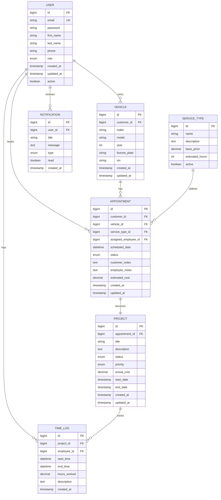

# Automobile Service Management System
## Complete Architecture & Implementation Guide

# Clone the repository
git clone https://github.com/ThilshathSmt/TechDrive.git
cd TechDrive

# Build and start all services with Docker Compose
docker-compose up -d --build

# Verify running containers
docker ps

# Check backend API health (Spring Boot)
curl http://localhost:8080/actuator/health

# Check frontend
http://localhost:3000

# Stop all running containers
docker-compose down


### 📋 Table of Contents
1. [System Overview](#system-overview)
2. [Architecture Design](#architecture-design)
3. [Technology Stack](#technology-stack)
4. [Database Design](#database-design)
5. [Backend Implementation](#backend-implementation)
6. [Frontend Implementation](#frontend-implementation)
7. [Real-time Updates](#real-time-updates)
8. [Authentication & Security](#authentication--security)
9. [API Design](#api-design)
10. [Containerization](#containerization)
11. [Testing Strategy](#testing-strategy)
12. [Deployment](#deployment)
13. [Team Member Responsibilities](#team-member-responsibilities)

---

## 🎯 System Overview

The Automobile Service Management System is a comprehensive enterprise application that enables:
- **Customers**: Book appointments, track service progress, request modifications
- **Employees**: Log time, update service status, manage appointments
- **Real-time Communication**: WebSocket-based live updates
- **AI Integration**: Chatbot for appointment queries

### Key Features
- Role-based authentication (Customer/Employee)
- Real-time service progress tracking
- Appointment booking and management
- Time logging for employees
- Mobile-responsive design
- AI-powered chatbot (bonus)
- Containerized deployment

---

## 🏗️ Architecture Design

### High-Level Architecture
```
┌─────────────────┐    ┌─────────────────┐    ┌─────────────────┐
│   React Client  │◄──►│  Spring Boot    │◄──►│     MySQL       │
│   (Frontend)    │    │   (Backend)     │    │   Database      │
└─────────────────┘    └─────────────────┘    └─────────────────┘
         │                       │                       │
         │                       │                       │
    WebSocket              REST APIs               JPA/Hibernate
    Real-time              JWT Auth                Transactions
    Updates                Validation              Data Persistence
```

### Layered Architecture Pattern

#### 1. Presentation Layer (React Frontend)
- **Customer Portal**: Dashboard, booking, progress tracking
- **Employee Portal**: Time logging, status updates, appointment management
- **Real-time Updates**: WebSocket client integration
- **Responsive Design**: Mobile-first approach

#### 2. API Layer (Spring Boot Controllers)
- **Authentication Controller**: Login/signup endpoints
- **Customer Controller**: Booking, vehicle management
- **Employee Controller**: Time logging, status updates
- **WebSocket Controller**: Real-time communication
- **Chatbot Controller**: AI integration (bonus)

#### 3. Business Logic Layer (Services)
- **Authentication Service**: JWT generation, validation
- **Appointment Service**: Booking logic, validation
- **Vehicle Service**: CRUD operations
- **Time Logging Service**: Work hour tracking
- **Notification Service**: Real-time updates

#### 4. Data Access Layer (Repositories)
- **JPA Repositories**: Data persistence
- **Custom Queries**: Complex business queries
- **Transaction Management**: Data consistency

#### 5. Database Layer (MySQL)
- **Normalized Schema**: Optimized for performance
- **Indexes**: Query optimization
- **Constraints**: Data integrity

---

## 🛠️ Technology Stack

### Backend Stack
```yaml
Framework: Spring Boot 3.2+
Language: Java 17+
Security: Spring Security + JWT
Database: MySQL 8.0+
ORM: Spring Data JPA + Hibernate
WebSocket: Spring WebSocket + STOMP
Testing: JUnit 5, Mockito, TestContainers
Build Tool: Maven
Documentation: OpenAPI 3 (Swagger)
```

### Frontend Stack
```yaml
Framework: React 18+
Language: TypeScript
State Management: Redux Toolkit + RTK Query
Routing: React Router v6
UI Framework: Material-UI (MUI) / Tailwind CSS
Real-time: WebSocket Client
HTTP Client: Axios
Testing: Jest, React Testing Library
Build Tool: Vite
```

### DevOps & Infrastructure
```yaml
Containerization: Docker + Docker Compose
Orchestration: Kubernetes (bonus)
Reverse Proxy: Nginx
Monitoring: Prometheus + Grafana (optional)
CI/CD: GitHub Actions (optional)
```

---

## 🗄️ Database Design

### Entity Relationship Diagram (ERD)



### Database Schema (MySQL)

```sql
-- Users table (both customers and employees)
CREATE TABLE users (
    id BIGINT AUTO_INCREMENT PRIMARY KEY,
    email VARCHAR(255) NOT NULL UNIQUE,
    password VARCHAR(255) NOT NULL,
    first_name VARCHAR(100) NOT NULL,
    last_name VARCHAR(100) NOT NULL,
    phone VARCHAR(20),
    role ENUM('CUSTOMER', 'EMPLOYEE', 'ADMIN') NOT NULL,
    active BOOLEAN DEFAULT TRUE,
    created_at TIMESTAMP DEFAULT CURRENT_TIMESTAMP,
    updated_at TIMESTAMP DEFAULT CURRENT_TIMESTAMP ON UPDATE CURRENT_TIMESTAMP,
    INDEX idx_email (email),
    INDEX idx_role (role)
);

-- Vehicles table
CREATE TABLE vehicles (
    id BIGINT AUTO_INCREMENT PRIMARY KEY,
    customer_id BIGINT NOT NULL,
    make VARCHAR(50) NOT NULL,
    model VARCHAR(50) NOT NULL,
    year INT NOT NULL,
    license_plate VARCHAR(20) UNIQUE,
    vin VARCHAR(17) UNIQUE,
    created_at TIMESTAMP DEFAULT CURRENT_TIMESTAMP,
    updated_at TIMESTAMP DEFAULT CURRENT_TIMESTAMP ON UPDATE CURRENT_TIMESTAMP,
    FOREIGN KEY (customer_id) REFERENCES users(id) ON DELETE CASCADE,
    INDEX idx_customer_id (customer_id),
    INDEX idx_license_plate (license_plate)
);

-- Service types
CREATE TABLE service_types (
    id BIGINT AUTO_INCREMENT PRIMARY KEY,
    name VARCHAR(100) NOT NULL,
    description TEXT,
    base_price DECIMAL(10,2) NOT NULL,
    estimated_hours INT NOT NULL,
    active BOOLEAN DEFAULT TRUE,
    created_at TIMESTAMP DEFAULT CURRENT_TIMESTAMP
);

-- Appointments
CREATE TABLE appointments (
    id BIGINT AUTO_INCREMENT PRIMARY KEY,
    customer_id BIGINT NOT NULL,
    vehicle_id BIGINT NOT NULL,
    service_type_id BIGINT NOT NULL,
    assigned_employee_id BIGINT,
    scheduled_date DATETIME NOT NULL,
    status ENUM('PENDING', 'CONFIRMED', 'IN_PROGRESS', 'COMPLETED', 'CANCELLED') DEFAULT 'PENDING',
    customer_notes TEXT,
    employee_notes TEXT,
    estimated_cost DECIMAL(10,2),
    created_at TIMESTAMP DEFAULT CURRENT_TIMESTAMP,
    updated_at TIMESTAMP DEFAULT CURRENT_TIMESTAMP ON UPDATE CURRENT_TIMESTAMP,
    FOREIGN KEY (customer_id) REFERENCES users(id),
    FOREIGN KEY (vehicle_id) REFERENCES vehicles(id),
    FOREIGN KEY (service_type_id) REFERENCES service_types(id),
    FOREIGN KEY (assigned_employee_id) REFERENCES users(id),
    INDEX idx_customer_id (customer_id),
    INDEX idx_scheduled_date (scheduled_date),
    INDEX idx_status (status)
);

-- Projects (detailed work breakdown)
CREATE TABLE projects (
    id BIGINT AUTO_INCREMENT PRIMARY KEY,
    appointment_id BIGINT NOT NULL UNIQUE,
    title VARCHAR(200) NOT NULL,
    description TEXT,
    status ENUM('NOT_STARTED', 'IN_PROGRESS', 'COMPLETED', 'ON_HOLD') DEFAULT 'NOT_STARTED',
    priority ENUM('LOW', 'MEDIUM', 'HIGH', 'URGENT') DEFAULT 'MEDIUM',
    actual_cost DECIMAL(10,2) DEFAULT 0.00,
    start_date TIMESTAMP NULL,
    end_date TIMESTAMP NULL,
    created_at TIMESTAMP DEFAULT CURRENT_TIMESTAMP,
    updated_at TIMESTAMP DEFAULT CURRENT_TIMESTAMP ON UPDATE CURRENT_TIMESTAMP,
    FOREIGN KEY (appointment_id) REFERENCES appointments(id) ON DELETE CASCADE,
    INDEX idx_status (status),
    INDEX idx_priority (priority)
);

-- Time logs
CREATE TABLE time_logs (
    id BIGINT AUTO_INCREMENT PRIMARY KEY,
    project_id BIGINT NOT NULL,
    employee_id BIGINT NOT NULL,
    start_time DATETIME NOT NULL,
    end_time DATETIME,
    hours_worked DECIMAL(4,2) DEFAULT 0.00,
    description TEXT,
    created_at TIMESTAMP DEFAULT CURRENT_TIMESTAMP,
    FOREIGN KEY (project_id) REFERENCES projects(id) ON DELETE CASCADE,
    FOREIGN KEY (employee_id) REFERENCES users(id),
    INDEX idx_project_id (project_id),
    INDEX idx_employee_id (employee_id),
    INDEX idx_start_time (start_time)
);

-- Notifications
CREATE TABLE notifications (
    id BIGINT AUTO_INCREMENT PRIMARY KEY,
    user_id BIGINT NOT NULL,
    title VARCHAR(200) NOT NULL,
    message TEXT NOT NULL,
    type ENUM('INFO', 'SUCCESS', 'WARNING', 'ERROR') DEFAULT 'INFO',
    read_status BOOLEAN DEFAULT FALSE,
    created_at TIMESTAMP DEFAULT CURRENT_TIMESTAMP,
    FOREIGN KEY (user_id) REFERENCES users(id) ON DELETE CASCADE,
    INDEX idx_user_id (user_id),
    INDEX idx_read_status (read_status)
);
```

---

## 🔧 Backend Implementation

### Project Structure
```
src/main/java/com/automobile/service/
├── config/
│   ├── SecurityConfig.java
│   ├── WebSocketConfig.java
│   ├── CorsConfig.java
│   └── SwaggerConfig.java
├── controller/
│   ├── AuthController.java
│   ├── CustomerController.java
│   ├── EmployeeController.java
│   ├── WebSocketController.java
│   └── ChatbotController.java
├── dto/
│   ├── request/
│   └── response/
├── entity/
│   ├── User.java
│   ├── Vehicle.java
│   ├── Appointment.java
│   ├── Project.java
│   ├── TimeLog.java
│   └── Notification.java
├── repository/
│   ├── UserRepository.java
│   ├── VehicleRepository.java
│   ├── AppointmentRepository.java
│   ├── ProjectRepository.java
│   ├── TimeLogRepository.java
│   └── NotificationRepository.java
├── service/
│   ├── AuthService.java
│   ├── CustomerService.java
│   ├── EmployeeService.java
│   ├── NotificationService.java
│   └── ChatbotService.java
├── security/
│   ├── JwtUtil.java
│   ├── JwtAuthenticationEntryPoint.java
│   └── JwtRequestFilter.java
├── exception/
│   ├── GlobalExceptionHandler.java
│   └── CustomExceptions.java
└── util/
    └── Constants.java
```

### Key Backend Components

#### 1. Authentication & Security Configuration
```java
@Configuration
@EnableWebSecurity
@EnableGlobalMethodSecurity(prePostEnabled = true)
public class SecurityConfig {
    
    @Bean
    public PasswordEncoder passwordEncoder() {
        return new BCryptPasswordEncoder();
    }
    
    @Bean
    public JwtAuthenticationEntryPoint jwtAuthenticationEntryPoint() {
        return new JwtAuthenticationEntryPoint();
    }
    
    @Bean
    public SecurityFilterChain filterChain(HttpSecurity http) throws Exception {
        http.csrf().disable()
            .authorizeHttpRequests(authz -> authz
                .requestMatchers("/api/auth/**", "/ws/**").permitAll()
                .requestMatchers("/api/customer/**").hasRole("CUSTOMER")
                .requestMatchers("/api/employee/**").hasRole("EMPLOYEE")
                .anyRequest().authenticated()
            )
            .exceptionHandling().authenticationEntryPoint(jwtAuthenticationEntryPoint())
            .and()
            .sessionManagement().sessionCreationPolicy(SessionCreationPolicy.STATELESS);
            
        http.addFilterBefore(jwtRequestFilter, UsernamePasswordAuthenticationFilter.class);
        return http.build();
    }
}
```

#### 2. WebSocket Configuration
```java
@Configuration
@EnableWebSocket
public class WebSocketConfig implements WebSocketConfigurer {
    
    @Override
    public void registerWebSocketHandlers(WebSocketHandlerRegistry registry) {
        registry.addHandler(new ServiceUpdateHandler(), "/ws/updates")
                .setAllowedOrigins("*");
    }
    
    @Component
    public static class ServiceUpdateHandler extends TextWebSocketHandler {
        private final Map<String, WebSocketSession> sessions = new ConcurrentHashMap<>();
        
        @Override
        public void afterConnectionEstablished(WebSocketSession session) {
            sessions.put(session.getId(), session);
        }
        
        public void broadcastUpdate(String userId, String message) {
            sessions.values().forEach(session -> {
                try {
                    session.sendMessage(new TextMessage(message));
                } catch (IOException e) {
                    log.error("Error sending message", e);
                }
            });
        }
    }
}
```

#### 3. Core Entities
```java
@Entity
@Table(name = "users")
public class User {
    @Id
    @GeneratedValue(strategy = GenerationType.IDENTITY)
    private Long id;
    
    @Column(unique = true, nullable = false)
    private String email;
    
    @Column(nullable = false)
    private String password;
    
    @Column(name = "first_name", nullable = false)
    private String firstName;
    
    @Column(name = "last_name", nullable = false)
    private String lastName;
    
    @Enumerated(EnumType.STRING)
    private Role role;
    
    @OneToMany(mappedBy = "customer", cascade = CascadeType.ALL, fetch = FetchType.LAZY)
    private List<Vehicle> vehicles = new ArrayList<>();
    
    // Constructors, getters, setters
}

@Entity
@Table(name = "appointments")
public class Appointment {
    @Id
    @GeneratedValue(strategy = GenerationType.IDENTITY)
    private Long id;
    
    @ManyToOne(fetch = FetchType.LAZY)
    @JoinColumn(name = "customer_id", nullable = false)
    private User customer;
    
    @ManyToOne(fetch = FetchType.LAZY)
    @JoinColumn(name = "vehicle_id", nullable = false)
    private Vehicle vehicle;
    
    @Column(name = "scheduled_date", nullable = false)
    private LocalDateTime scheduledDate;
    
    @Enumerated(EnumType.STRING)
    private AppointmentStatus status;
    
    @OneToOne(mappedBy = "appointment", cascade = CascadeType.ALL)
    private Project project;
    
    // Constructors, getters, setters
}
```

#### 4. Service Layer
```java
@Service
@Transactional
public class CustomerService {
    
    @Autowired
    private AppointmentRepository appointmentRepository;
    
    @Autowired
    private NotificationService notificationService;
    
    public AppointmentDto bookAppointment(BookAppointmentRequest request, String customerEmail) {
        User customer = userRepository.findByEmail(customerEmail)
            .orElseThrow(() -> new UserNotFoundException("Customer not found"));
            
        Appointment appointment = new Appointment();
        appointment.setCustomer(customer);
        appointment.setScheduledDate(request.getScheduledDate());
        appointment.setStatus(AppointmentStatus.PENDING);
        
        Appointment saved = appointmentRepository.save(appointment);
        
        // Create project
        Project project = new Project();
        project.setAppointment(saved);
        project.setTitle("Service: " + request.getServiceType());
        project.setStatus(ProjectStatus.NOT_STARTED);
        projectRepository.save(project);
        
        // Send notification
        notificationService.sendAppointmentConfirmation(customer, saved);
        
        return AppointmentMapper.toDto(saved);
    }
    
    public List<AppointmentDto> getCustomerAppointments(String customerEmail) {
        User customer = userRepository.findByEmail(customerEmail)
            .orElseThrow(() -> new UserNotFoundException("Customer not found"));
            
        return appointmentRepository.findByCustomerOrderByScheduledDateDesc(customer)
            .stream()
            .map(AppointmentMapper::toDto)
            .collect(Collectors.toList());
    }
}
```

---

## 🎨 Frontend Implementation

### Project Structure
```
src/
├── components/
│   ├── common/
│   │   ├── Header.tsx
│   │   ├── Navigation.tsx
│   │   ├── LoadingSpinner.tsx
│   │   └── ErrorBoundary.tsx
│   ├── customer/
│   │   ├── Dashboard.tsx
│   │   ├── BookingForm.tsx
│   │   ├── AppointmentList.tsx
│   │   └── VehicleManager.tsx
│   ├── employee/
│   │   ├── Dashboard.tsx
│   │   ├── TimeLogger.tsx
│   │   ├── ProjectUpdater.tsx
│   │   └── AppointmentViewer.tsx
│   ├── auth/
│   │   ├── LoginForm.tsx
│   │   ├── SignupForm.tsx
│   │   └── ProtectedRoute.tsx
│   └── chatbot/
│       ├── ChatInterface.tsx
│       └── MessageBubble.tsx
├── hooks/
│   ├── useAuth.ts
│   ├── useWebSocket.ts
│   ├── useApi.ts
│   └── useNotifications.ts
├── services/
│   ├── api.ts
│   ├── auth.service.ts
│   ├── customer.service.ts
│   ├── employee.service.ts
│   └── websocket.service.ts
├── store/
│   ├── store.ts
│   ├── authSlice.ts
│   ├── appointmentSlice.ts
│   └── notificationSlice.ts
├── types/
│   ├── auth.types.ts
│   ├── appointment.types.ts
│   └── common.types.ts
├── utils/
│   ├── constants.ts
│   ├── formatters.ts
│   └── validators.ts
└── pages/
    ├── LoginPage.tsx
    ├── CustomerDashboard.tsx
    ├── EmployeeDashboard.tsx
    └── NotFoundPage.tsx
```

### Key Frontend Components

#### 1. Authentication Hook
```typescript
// hooks/useAuth.ts
export const useAuth = () => {
  const dispatch = useAppDispatch();
  const { user, token, isLoading } = useAppSelector(state => state.auth);

  const login = async (email: string, password: string) => {
    try {
      const response = await authService.login(email, password);
      dispatch(setCredentials(response));
      localStorage.setItem('token', response.token);
      return response;
    } catch (error) {
      throw error;
    }
  };

  const logout = () => {
    dispatch(clearCredentials());
    localStorage.removeItem('token');
  };

  return { user, token, isLoading, login, logout };
};
```

#### 2. WebSocket Hook
```typescript
// hooks/useWebSocket.ts
export const useWebSocket = (userId: string) => {
  const [socket, setSocket] = useState<WebSocket | null>(null);
  const dispatch = useAppDispatch();

  useEffect(() => {
    const ws = new WebSocket(`ws://localhost:8080/ws/updates`);
    
    ws.onopen = () => {
      console.log('WebSocket connected');
      ws.send(JSON.stringify({ type: 'JOIN', userId }));
    };

    ws.onmessage = (event) => {
      const data = JSON.parse(event.data);
      dispatch(addNotification(data));
    };

    ws.onclose = () => {
      console.log('WebSocket disconnected');
    };

    setSocket(ws);

    return () => {
      ws.close();
    };
  }, [userId, dispatch]);

  return socket;
};
```

#### 3. Customer Dashboard
```typescript
// components/customer/Dashboard.tsx
const CustomerDashboard: React.FC = () => {
  const { user } = useAuth();
  const [appointments, setAppointments] = useState<Appointment[]>([]);
  const [isLoading, setIsLoading] = useState(true);
  
  useWebSocket(user?.id.toString() || '');

  useEffect(() => {
    const loadAppointments = async () => {
      try {
        const data = await customerService.getAppointments();
        setAppointments(data);
      } catch (error) {
        console.error('Failed to load appointments:', error);
      } finally {
        setIsLoading(false);
      }
    };

    loadAppointments();
  }, []);

  if (isLoading) {
    return <LoadingSpinner />;
  }

  return (
    <Container maxWidth="lg" sx={{ mt: 4, mb: 4 }}>
      <Typography variant="h4" gutterBottom>
        Welcome back, {user?.firstName}!
      </Typography>
      
      <Grid container spacing={3}>
        <Grid item xs={12} md={8}>
          <Paper sx={{ p: 2 }}>
            <Typography variant="h6" gutterBottom>
              Your Appointments
            </Typography>
            <AppointmentList appointments={appointments} />
          </Paper>
        </Grid>
        
        <Grid item xs={12} md={4}>
          <Paper sx={{ p: 2 }}>
            <Typography variant="h6" gutterBottom>
              Quick Actions
            </Typography>
            <Button
              variant="contained"
              fullWidth
              sx={{ mb: 2 }}
              component={Link}
              to="/customer/book-appointment"
            >
              Book New Service
            </Button>
            <Button
              variant="outlined"
              fullWidth
              component={Link}
              to="/customer/vehicles"
            >
              Manage Vehicles
            </Button>
          </Paper>
        </Grid>
      </Grid>
    </Container>
  );
};
```

#### 4. Employee Time Logger
```typescript
// components/employee/TimeLogger.tsx
const TimeLogger: React.FC = () => {
  const [projects, setProjects] = useState<Project[]>([]);
  const [selectedProject, setSelectedProject] = useState<string>('');
  const [startTime, setStartTime] = useState<string>('');
  const [endTime, setEndTime] = useState<string>('');
  const [description, setDescription] = useState<string>('');

  const handleSubmit = async (e: React.FormEvent) => {
    e.preventDefault();
    
    try {
      await employeeService.logTime({
        projectId: selectedProject,
        startTime: new Date(startTime),
        endTime: new Date(endTime),
        description
      });
      
      // Reset form
      setSelectedProject('');
      setStartTime('');
      setEndTime('');
      setDescription('');
      
      alert('Time logged successfully!');
    } catch (error) {
      console.error('Failed to log time:', error);
    }
  };

  return (
    <Paper sx={{ p: 3 }}>
      <Typography variant="h6" gutterBottom>
        Log Time
      </Typography>
      
      <form onSubmit={handleSubmit}>
        <FormControl fullWidth margin="normal">
          <InputLabel>Select Project</InputLabel>
          <Select
            value={selectedProject}
            onChange={(e) => setSelectedProject(e.target.value)}
            required
          >
            {projects.map((project) => (
              <MenuItem key={project.id} value={project.id}>
                {project.title}
              </MenuItem>
            ))}
          </Select>
        </FormControl>

        <TextField
          fullWidth
          margin="normal"
          label="Start Time"
          type="datetime-local"
          value={startTime}
          onChange={(e) => setStartTime(e.target.value)}
          InputLabelProps={{ shrink: true }}
          required
        />

        <TextField
          fullWidth
          margin="normal"
          label="End Time"
          type="datetime-local"
          value={endTime}
          onChange={(e) => setEndTime(e.target.value)}
          InputLabelProps={{ shrink: true }}
          required
        />

        <TextField
          fullWidth
          margin="normal"
          label="Description"
          multiline
          rows={3}
          value={description}
          onChange={(e) => setDescription(e.target.value)}
          required
        />

        <Button
          type="submit"
          variant="contained"
          sx={{ mt: 2 }}
          fullWidth
        >
          Log Time
        </Button>
      </form>
    </Paper>
  );
};
```

---

## ⚡ Real-time Updates

### WebSocket Implementation

#### Backend WebSocket Handler
```java
@Component
public class ServiceUpdateHandler extends TextWebSocketHandler {
    private final Map<String, WebSocketSession> userSessions = new ConcurrentHashMap<>();
    
    @Override
    public void afterConnectionEstablished(WebSocketSession session) {
        String userId = getUserIdFromSession(session);
        userSessions.put(userId, session);
        log.info("User {} connected to WebSocket", userId);
    }
    
    @Override
    public void afterConnectionClosed(WebSocketSession session, CloseStatus status) {
        String userId = getUserIdFromSession(session);
        userSessions.remove(userId);
        log.info("User {} disconnected from WebSocket", userId);
    }
    
    public void sendUpdateToUser(String userId, Object update) {
        WebSocketSession session = userSessions.get(userId);
        if (session != null && session.isOpen()) {
            try {
                String message = objectMapper.writeValueAsString(update);
                session.sendMessage(new TextMessage(message));
            } catch (Exception e) {
                log.error("Error sending update to user {}", userId, e);
            }
        }
    }
}
```

#### Frontend WebSocket Service
```typescript
// services/websocket.service.ts
class WebSocketService {
  private socket: WebSocket | null = null;
  private callbacks: Map<string, (data: any) => void> = new Map();

  connect(userId: string) {
    this.socket = new WebSocket(`${process.env.REACT_APP_WS_URL}/ws/updates`);
    
    this.socket.onopen = () => {
      console.log('WebSocket connected');
      this.send({ type: 'JOIN', userId });
    };

    this.socket.onmessage = (event) => {
      const data = JSON.parse(event.data);
      const callback = this.callbacks.get(data.type);
      if (callback) {
        callback(data);
      }
    };

    this.socket.onclose = () => {
      console.log('WebSocket disconnected');
      // Implement reconnection logic
      setTimeout(() => this.connect(userId), 5000);
    };
  }

  subscribe(eventType: string, callback: (data: any) => void) {
    this.callbacks.set(eventType, callback);
  }

  send(data: any) {
    if (this.socket && this.socket.readyState === WebSocket.OPEN) {
      this.socket.send(JSON.stringify(data));
    }
  }

  disconnect() {
    if (this.socket) {
      this.socket.close();
      this.socket = null;
    }
  }
}

export const websocketService = new WebSocketService();
```

---

## 🔐 Authentication & Security

### JWT Implementation

#### JWT Utility Class
```java
@Component
public class JwtUtil {
    private final String SECRET_KEY = "mySecretKey";
    private final int JWT_EXPIRATION = 86400000; // 24 hours

    public String generateToken(UserDetails userDetails) {
        Map<String, Object> claims = new HashMap<>();
        claims.put("role", userDetails.getAuthorities().iterator().next().getAuthority());
        return createToken(claims, userDetails.getUsername());
    }

    private String createToken(Map<String, Object> claims, String subject) {
        return Jwts.builder()
                .setClaims(claims)
                .setSubject(subject)
                .setIssuedAt(new Date(System.currentTimeMillis()))
                .setExpiration(new Date(System.currentTimeMillis() + JWT_EXPIRATION))
                .signWith(SignatureAlgorithm.HS512, SECRET_KEY)
                .compact();
    }

    public Boolean validateToken(String token, UserDetails userDetails) {
        final String username = getUsernameFromToken(token);
        return (username.equals(userDetails.getUsername()) && !isTokenExpired(token));
    }
}
```

#### Frontend Auth Service
```typescript
// services/auth.service.ts
class AuthService {
  private readonly API_URL = process.env.REACT_APP_API_URL + '/api/auth';

  async login(email: string, password: string): Promise<AuthResponse> {
    const response = await api.post<AuthResponse>(`${this.API_URL}/login`, {
      email,
      password
    });
    
    if (response.data.token) {
      localStorage.setItem('token', response.data.token);
      api.defaults.headers.common['Authorization'] = `Bearer ${response.data.token}`;
    }
    
    return response.data;
  }

  async signup(userData: SignupRequest): Promise<AuthResponse> {
    const response = await api.post<AuthResponse>(`${this.API_URL}/signup`, userData);
    return response.data;
  }

  logout(): void {
    localStorage.removeItem('token');
    delete api.defaults.headers.common['Authorization'];
  }

  getCurrentUser(): User | null {
    const token = localStorage.getItem('token');
    if (!token) return null;
    
    try {
      const payload = JSON.parse(atob(token.split('.')[1]));
      return payload;
    } catch (error) {
      return null;
    }
  }

  isTokenValid(): boolean {
    const token = localStorage.getItem('token');
    if (!token) return false;
    
    try {
      const payload = JSON.parse(atob(token.split('.')[1]));
      return payload.exp * 1000 > Date.now();
    } catch (error) {
      return false;
    }
  }
}

export const authService = new AuthService();
```

---

## 📡 API Design

### REST API Endpoints

#### Authentication Endpoints
```yaml
POST /api/auth/login
  Description: User login
  Request Body:
    {
      "email": "string",
      "password": "string"
    }
  Response:
    {
      "token": "string",
      "user": {
        "id": "number",
        "email": "string",
        "firstName": "string",
        "lastName": "string",
        "role": "CUSTOMER|EMPLOYEE|ADMIN"
      }
    }

POST /api/auth/signup
  Description: Customer registration
  Request Body:
    {
      "email": "string",
      "password": "string",
      "firstName": "string",
      "lastName": "string",
      "phone": "string"
    }
  Response: Same as login

POST /api/auth/refresh
  Description: Refresh JWT token
  Headers: Authorization: Bearer <token>
  Response:
    {
      "token": "string"
    }
```

#### Customer Endpoints
```yaml
GET /api/customer/profile
  Description: Get customer profile
  Headers: Authorization: Bearer <token>
  Response:
    {
      "id": "number",
      "email": "string",
      "firstName": "string",
      "lastName": "string",
      "phone": "string",
      "vehicles": []
    }

GET /api/customer/appointments
  Description: Get customer appointments
  Headers: Authorization: Bearer <token>
  Query Parameters:
    - status: "PENDING|CONFIRMED|IN_PROGRESS|COMPLETED|CANCELLED"
    - page: number (default: 0)
    - size: number (default: 10)
  Response:
    {
      "content": [
        {
          "id": "number",
          "vehicle": {...},
          "scheduledDate": "datetime",
          "status": "string",
          "project": {...}
        }
      ],
      "totalElements": "number",
      "totalPages": "number"
    }

POST /api/customer/appointments
  Description: Book new appointment
  Headers: Authorization: Bearer <token>
  Request Body:
    {
      "vehicleId": "number",
      "serviceTypeId": "number",
      "scheduledDate": "datetime",
      "customerNotes": "string"
    }
  Response: Appointment object

GET /api/customer/vehicles
  Description: Get customer vehicles
  Headers: Authorization: Bearer <token>
  Response: Array of vehicle objects

POST /api/customer/vehicles
  Description: Add new vehicle
  Headers: Authorization: Bearer <token>
  Request Body:
    {
      "make": "string",
      "model": "string",
      "year": "number",
      "licensePlate": "string",
      "vin": "string"
    }
  Response: Vehicle object

PUT /api/customer/vehicles/{id}
  Description: Update vehicle
  Headers: Authorization: Bearer <token>
  Path Parameters: id (vehicle ID)
  Request Body: Vehicle update data
  Response: Updated vehicle object

DELETE /api/customer/vehicles/{id}
  Description: Delete vehicle
  Headers: Authorization: Bearer <token>
  Path Parameters: id (vehicle ID)
  Response: 204 No Content
```

#### Employee Endpoints
```yaml
GET /api/employee/assignments
  Description: Get assigned appointments/projects
  Headers: Authorization: Bearer <token>
  Query Parameters:
    - status: "NOT_STARTED|IN_PROGRESS|COMPLETED|ON_HOLD"
    - startDate: "date"
    - endDate: "date"
  Response: Array of project objects

POST /api/employee/timelogs
  Description: Log time for project
  Headers: Authorization: Bearer <token>
  Request Body:
    {
      "projectId": "number",
      "startTime": "datetime",
      "endTime": "datetime",
      "description": "string"
    }
  Response: TimeLog object

GET /api/employee/timelogs
  Description: Get employee time logs
  Headers: Authorization: Bearer <token>
  Query Parameters:
    - projectId: number
    - startDate: date
    - endDate: date
  Response: Array of TimeLog objects

PUT /api/employee/projects/{id}/status
  Description: Update project status
  Headers: Authorization: Bearer <token>
  Path Parameters: id (project ID)
  Request Body:
    {
      "status": "NOT_STARTED|IN_PROGRESS|COMPLETED|ON_HOLD",
      "notes": "string"
    }
  Response: Updated project object

GET /api/employee/dashboard
  Description: Get employee dashboard data
  Headers: Authorization: Bearer <token>
  Response:
    {
      "activeProjects": number,
      "todayAppointments": number,
      "weeklyHours": number,
      "recentProjects": [],
      "upcomingAppointments": []
    }
```

### Error Handling
```java
@RestControllerAdvice
public class GlobalExceptionHandler {
    
    @ExceptionHandler(ValidationException.class)
    public ResponseEntity<ErrorResponse> handleValidationException(ValidationException ex) {
        ErrorResponse error = new ErrorResponse(
            HttpStatus.BAD_REQUEST.value(),
            "Validation Error",
            ex.getMessage(),
            Instant.now()
        );
        return ResponseEntity.badRequest().body(error);
    }
    
    @ExceptionHandler(ResourceNotFoundException.class)
    public ResponseEntity<ErrorResponse> handleResourceNotFoundException(ResourceNotFoundException ex) {
        ErrorResponse error = new ErrorResponse(
            HttpStatus.NOT_FOUND.value(),
            "Resource Not Found",
            ex.getMessage(),
            Instant.now()
        );
        return ResponseEntity.status(HttpStatus.NOT_FOUND).body(error);
    }
    
    @ExceptionHandler(UnauthorizedException.class)
    public ResponseEntity<ErrorResponse> handleUnauthorizedException(UnauthorizedException ex) {
        ErrorResponse error = new ErrorResponse(
            HttpStatus.UNAUTHORIZED.value(),
            "Unauthorized",
            ex.getMessage(),
            Instant.now()
        );
        return ResponseEntity.status(HttpStatus.UNAUTHORIZED).body(error);
    }
}
```

---

## 🐳 Containerization

### Docker Configuration

#### Backend Dockerfile
```dockerfile
# Backend Dockerfile
FROM openjdk:17-jdk-slim

WORKDIR /app

# Copy Maven files for dependency caching
COPY pom.xml .
COPY .mvn .mvn
COPY mvnw .

# Download dependencies
RUN ./mvnw dependency:go-offline -B

# Copy source code
COPY src ./src

# Build application
RUN ./mvnw clean package -DskipTests

# Expose port
EXPOSE 8080

# Run application
CMD ["java", "-jar", "target/automobile-service-*.jar"]
```

#### Frontend Dockerfile
```dockerfile
# Frontend Dockerfile
# Build stage
FROM node:18-alpine AS build

WORKDIR /app

# Copy package files
COPY package*.json ./

# Install dependencies
RUN npm ci --only=production

# Copy source code
COPY . .

# Build application
RUN npm run build

# Production stage
FROM nginx:alpine

# Copy custom nginx config
COPY nginx.conf /etc/nginx/nginx.conf

# Copy built application
COPY --from=build /app/build /usr/share/nginx/html

# Expose port
EXPOSE 80

# Start nginx
CMD ["nginx", "-g", "daemon off;"]
```

#### Nginx Configuration
```nginx
# nginx.conf
events {
    worker_connections 1024;
}

http {
    include       /etc/nginx/mime.types;
    default_type  application/octet-stream;

    server {
        listen 80;
        server_name localhost;
        root /usr/share/nginx/html;
        index index.html;

        # Handle React Router
        location / {
            try_files $uri $uri/ /index.html;
        }

        # API proxy
        location /api {
            proxy_pass http://backend:8080;
            proxy_set_header Host $host;
            proxy_set_header X-Real-IP $remote_addr;
            proxy_set_header X-Forwarded-For $proxy_add_x_forwarded_for;
            proxy_set_header X-Forwarded-Proto $scheme;
        }

        # WebSocket proxy
        location /ws {
            proxy_pass http://backend:8080;
            proxy_http_version 1.1;
            proxy_set_header Upgrade $http_upgrade;
            proxy_set_header Connection "upgrade";
            proxy_set_header Host $host;
            proxy_set_header X-Real-IP $remote_addr;
            proxy_set_header X-Forwarded-For $proxy_add_x_forwarded_for;
            proxy_set_header X-Forwarded-Proto $scheme;
        }
    }
}
```

### Docker Compose Configuration
```yaml
# docker-compose.yml
version: '3.8'

services:
  # Database
  mysql:
    image: mysql:8.0
    container_name: automobile-db
    environment:
      MYSQL_ROOT_PASSWORD: rootpassword
      MYSQL_DATABASE: automobile_service
      MYSQL_USER: app_user
      MYSQL_PASSWORD: app_password
    ports:
      - "3306:3306"
    volumes:
      - mysql_data:/var/lib/mysql
      - ./sql/init.sql:/docker-entrypoint-initdb.d/init.sql
    networks:
      - automobile-network
    command: --default-authentication-plugin=mysql_native_password

  # Backend
  backend:
    build: 
      context: ./backend
      dockerfile: Dockerfile
    container_name: automobile-backend
    environment:
      SPRING_PROFILES_ACTIVE: docker
      SPRING_DATASOURCE_URL: jdbc:mysql://mysql:3306/automobile_service
      SPRING_DATASOURCE_USERNAME: app_user
      SPRING_DATASOURCE_PASSWORD: app_password
      JWT_SECRET: mySecretKey12345
      OPENAI_API_KEY: ${OPENAI_API_KEY}
    ports:
      - "8080:8080"
    depends_on:
      - mysql
    networks:
      - automobile-network
    volumes:
      - ./backend/logs:/app/logs

  # Frontend
  frontend:
    build: 
      context: ./frontend
      dockerfile: Dockerfile
    container_name: automobile-frontend
    environment:
      REACT_APP_API_URL: http://localhost:8080
      REACT_APP_WS_URL: ws://localhost:8080
    ports:
      - "80:80"
    depends_on:
      - backend
    networks:
      - automobile-network

volumes:
  mysql_data:
    driver: local

networks:
  automobile-network:
    driver: bridge
```

### Docker Compose for Development
```yaml
# docker-compose.dev.yml
version: '3.8'

services:
  mysql:
    image: mysql:8.0
    environment:
      MYSQL_ROOT_PASSWORD: rootpassword
      MYSQL_DATABASE: automobile_service
      MYSQL_USER: app_user
      MYSQL_PASSWORD: app_password
    ports:
      - "3306:3306"
    volumes:
      - mysql_data:/var/lib/mysql

  # For development, run backend and frontend locally
  # This compose file only provides the database

volumes:
  mysql_data:
```

---

## 🧪 Testing Strategy

### Backend Testing

#### Unit Tests
```java
// CustomerServiceTest.java
@ExtendWith(MockitoExtension.class)
class CustomerServiceTest {
    
    @Mock
    private AppointmentRepository appointmentRepository;
    
    @Mock
    private UserRepository userRepository;
    
    @Mock
    private NotificationService notificationService;
    
    @InjectMocks
    private CustomerService customerService;
    
    @Test
    void bookAppointment_ValidRequest_ReturnsAppointmentDto() {
        // Given
        String customerEmail = "test@example.com";
        BookAppointmentRequest request = new BookAppointmentRequest();
        request.setVehicleId(1L);
        request.setScheduledDate(LocalDateTime.now().plusDays(1));
        
        User customer = new User();
        customer.setEmail(customerEmail);
        
        when(userRepository.findByEmail(customerEmail))
            .thenReturn(Optional.of(customer));
        
        Appointment savedAppointment = new Appointment();
        savedAppointment.setId(1L);
        savedAppointment.setCustomer(customer);
        
        when(appointmentRepository.save(any(Appointment.class)))
            .thenReturn(savedAppointment);
        
        // When
        AppointmentDto result = customerService.bookAppointment(request, customerEmail);
        
        // Then
        assertNotNull(result);
        assertEquals(1L, result.getId());
        verify(appointmentRepository, times(1)).save(any(Appointment.class));
        verify(notificationService, times(1)).sendAppointmentConfirmation(any(), any());
    }
    
    @Test
    void bookAppointment_CustomerNotFound_ThrowsException() {
        // Given
        String customerEmail = "nonexistent@example.com";
        BookAppointmentRequest request = new BookAppointmentRequest();
        
        when(userRepository.findByEmail(customerEmail))
            .thenReturn(Optional.empty());
        
        // When & Then
        assertThrows(UserNotFoundException.class, 
            () -> customerService.bookAppointment(request, customerEmail));
    }
}
```

#### Integration Tests
```java
// CustomerControllerIntegrationTest.java
@SpringBootTest(webEnvironment = SpringBootTest.WebEnvironment.RANDOM_PORT)
@Testcontainers
@Transactional
class CustomerControllerIntegrationTest {
    
    @Container
    static MySQLContainer<?> mysql = new MySQLContainer<>("mysql:8.0")
            .withDatabaseName("test_db")
            .withUsername("test")
            .withPassword("test");
    
    @Autowired
    private TestRestTemplate restTemplate;
    
    @Autowired
    private UserRepository userRepository;
    
    @LocalServerPort
    private int port;
    
    private String baseUrl;
    private String authToken;
    
    @BeforeEach
    void setUp() {
        baseUrl = "http://localhost:" + port;
        
        // Create test user and get auth token
        User testUser = new User();
        testUser.setEmail("test@example.com");
        testUser.setPassword("password");
        testUser.setRole(Role.CUSTOMER);
        userRepository.save(testUser);
        
        // Login and get token
        LoginRequest loginRequest = new LoginRequest("test@example.com", "password");
        ResponseEntity<AuthResponse> loginResponse = restTemplate.postForEntity(
            baseUrl + "/api/auth/login", loginRequest, AuthResponse.class);
        
        authToken = "Bearer " + loginResponse.getBody().getToken();
    }
    
    @Test
    void bookAppointment_ValidRequest_ReturnsCreatedAppointment() {
        // Given
        HttpHeaders headers = new HttpHeaders();
        headers.set("Authorization", authToken);
        
        BookAppointmentRequest request = new BookAppointmentRequest();
        request.setVehicleId(1L);
        request.setScheduledDate(LocalDateTime.now().plusDays(1));
        
        HttpEntity<BookAppointmentRequest> entity = new HttpEntity<>(request, headers);
        
        // When
        ResponseEntity<AppointmentDto> response = restTemplate.postForEntity(
            baseUrl + "/api/customer/appointments", entity, AppointmentDto.class);
        
        // Then
        assertEquals(HttpStatus.CREATED, response.getStatusCode());
        assertNotNull(response.getBody());
        assertNotNull(response.getBody().getId());
    }
}
```

### Frontend Testing

#### Component Tests
```typescript
// components/customer/__tests__/Dashboard.test.tsx
import { render, screen, waitFor } from '@testing-library/react';
import { Provider } from 'react-redux';
import { BrowserRouter } from 'react-router-dom';
import { configureStore } from '@reduxjs/toolkit';
import CustomerDashboard from '../Dashboard';
import authSlice from '../../../store/authSlice';
import * as customerService from '../../../services/customer.service';

// Mock the customer service
jest.mock('../../../services/customer.service');
const mockCustomerService = customerService as jest.Mocked<typeof customerService>;

const mockStore = configureStore({
  reducer: {
    auth: authSlice,
  },
  preloadedState: {
    auth: {
      user: {
        id: 1,
        email: 'test@example.com',
        firstName: 'John',
        lastName: 'Doe',
        role: 'CUSTOMER'
      },
      token: 'mock-token',
      isLoading: false
    }
  }
});

const renderWithProviders = (component: React.ReactElement) => {
  return render(
    <Provider store={mockStore}>
      <BrowserRouter>
        {component}
      </BrowserRouter>
    </Provider>
  );
};

describe('CustomerDashboard', () => {
  beforeEach(() => {
    mockCustomerService.getAppointments.mockResolvedValue([]);
  });

  it('displays welcome message with user name', async () => {
    renderWithProviders(<CustomerDashboard />);
    
    await waitFor(() => {
      expect(screen.getByText('Welcome back, John!')).toBeInTheDocument();
    });
  });

  it('loads and displays appointments', async () => {
    const mockAppointments = [
      {
        id: 1,
        scheduledDate: '2024-01-15T10:00:00',
        status: 'CONFIRMED',
        vehicle: { make: 'Toyota', model: 'Camry' }
      }
    ];
    
    mockCustomerService.getAppointments.mockResolvedValue(mockAppointments);
    
    renderWithProviders(<CustomerDashboard />);
    
    await waitFor(() => {
      expect(screen.getByText('Your Appointments')).toBeInTheDocument();
    });
  });

  it('displays loading spinner while loading', () => {
    renderWithProviders(<CustomerDashboard />);
    expect(screen.getByTestId('loading-spinner')).toBeInTheDocument();
  });
});
```

#### API Service Tests
```typescript
// services/__tests__/customer.service.test.ts
import axios from 'axios';
import { customerService } from '../customer.service';

jest.mock('axios');
const mockedAxios = axios as jest.Mocked<typeof axios>;

describe('CustomerService', () => {
  beforeEach(() => {
    jest.clearAllMocks();
  });

  describe('getAppointments', () => {
    it('should fetch appointments successfully', async () => {
      const mockData = [
        { id: 1, scheduledDate: '2024-01-15T10:00:00', status: 'CONFIRMED' }
      ];
      
      mockedAxios.get.mockResolvedValueOnce({ data: mockData });

      const result = await customerService.getAppointments();

      expect(mockedAxios.get).toHaveBeenCalledWith('/api/customer/appointments');
      expect(result).toEqual(mockData);
    });

    it('should throw error when request fails', async () => {
      mockedAxios.get.mockRejectedValueOnce(new Error('Network Error'));

      await expect(customerService.getAppointments()).rejects.toThrow('Network Error');
    });
  });

  describe('bookAppointment', () => {
    it('should book appointment successfully', async () => {
      const mockRequest = {
        vehicleId: 1,
        serviceTypeId: 1,
        scheduledDate: new Date('2024-01-15T10:00:00')
      };
      
      const mockResponse = { id: 1, ...mockRequest };
      mockedAxios.post.mockResolvedValueOnce({ data: mockResponse });

      const result = await customerService.bookAppointment(mockRequest);

      expect(mockedAxios.post).toHaveBeenCalledWith('/api/customer/appointments', mockRequest);
      expect(result).toEqual(mockResponse);
    });
  });
});
```

### Test Configuration

#### Jest Configuration
```javascript
// frontend/jest.config.js
module.exports = {
  testEnvironment: 'jsdom',
  setupFilesAfterEnv: ['<rootDir>/src/setupTests.ts'],
  moduleNameMapping: {
    '^@/(.*): '<rootDir>/src/$1',
  },
  collectCoverageFrom: [
    'src/**/*.{ts,tsx}',
    '!src/**/*.d.ts',
    '!src/index.tsx',
    '!src/reportWebVitals.ts',
  ],
  coverageThreshold: {
    global: {
      branches: 70,
      functions: 70,
      lines: 70,
      statements: 70,
    },
  },
};
```

#### Test Utils
```typescript
// frontend/src/test-utils.tsx
import React from 'react';
import { render } from '@testing-library/react';
import { Provider } from 'react-redux';
import { BrowserRouter } from 'react-router-dom';
import { configureStore } from '@reduxjs/toolkit';
import authSlice from './store/authSlice';

export const createMockStore = (initialState?: any) => {
  return configureStore({
    reducer: {
      auth: authSlice,
    },
    preloadedState: initialState,
  });
};

export const renderWithProviders = (
  ui: React.ReactElement,
  {
    initialState,
    store = createMockStore(initialState),
    ...renderOptions
  } = {}
) => {
  const Wrapper = ({ children }: { children: React.ReactNode }) => (
    <Provider store={store}>
      <BrowserRouter>
        {children}
      </BrowserRouter>
    </Provider>
  );

  return render(ui, { wrapper: Wrapper, ...renderOptions });
};
```

---

## 🚀 Deployment

### Kubernetes Deployment (Bonus)

#### Namespace
```yaml
# k8s/namespace.yaml
apiVersion: v1
kind: Namespace
metadata:
  name: automobile-service
```

#### ConfigMap
```yaml
# k8s/configmap.yaml
apiVersion: v1
kind: ConfigMap
metadata:
  name: app-config
  namespace: automobile-service
data:
  DATABASE_URL: "jdbc:mysql://mysql-service:3306/automobile_service"
  DATABASE_USER: "app_user"
  SPRING_PROFILES_ACTIVE: "production"
  REACT_APP_API_URL: "http://backend-service:8080"
```

#### Secret
```yaml
# k8s/secret.yaml
apiVersion: v1
kind: Secret
metadata:
  name: app-secrets
  namespace: automobile-service
type: Opaque
data:
  DATABASE_PASSWORD: YXBwX3Bhc3N3b3Jk # base64 encoded
  JWT_SECRET: bXlTZWNyZXRLZXkxMjM0NQ== # base64 encoded
  MYSQL_ROOT_PASSWORD: cm9vdHBhc3N3b3Jk # base64 encoded
```

#### MySQL Deployment
```yaml
# k8s/mysql-deployment.yaml
apiVersion: apps/v1
kind: Deployment
metadata:
  name: mysql-deployment
  namespace: automobile-service
spec:
  replicas: 1
  selector:
    matchLabels:
      app: mysql
  template:
    metadata:
      labels:
        app: mysql
    spec:
      containers:
      - name: mysql
        image: mysql:8.0
        env:
        - name: MYSQL_ROOT_PASSWORD
          valueFrom:
            secretKeyRef:
              name: app-secrets
              key: MYSQL_ROOT_PASSWORD
        - name: MYSQL_DATABASE
          value: automobile_service
        - name: MYSQL_USER
          valueFrom:
            configMapKeyRef:
              name: app-config
              key: DATABASE_USER
        - name: MYSQL_PASSWORD
          valueFrom:
            secretKeyRef:
              name: app-secrets
              key: DATABASE_PASSWORD
        ports:
        - containerPort: 3306
        volumeMounts:
        - name: mysql-storage
          mountPath: /var/lib/mysql
      volumes:
      - name: mysql-storage
        persistentVolumeClaim:
          claimName: mysql-pvc
---
apiVersion: v1
kind: Service
metadata:
  name: mysql-service
  namespace: automobile-service
spec:
  selector:
    app: mysql
  ports:
  - port: 3306
    targetPort: 3306
---
apiVersion: v1
kind: PersistentVolumeClaim
metadata:
  name: mysql-pvc
  namespace: automobile-service
spec:
  accessModes:
    - ReadWriteOnce
  resources:
    requests:
      storage: 10Gi
```

#### Backend Deployment
```yaml
# k8s/backend-deployment.yaml
apiVersion: apps/v1
kind: Deployment
metadata:
  name: backend-deployment
  namespace: automobile-service
spec:
  replicas: 2
  selector:
    matchLabels:
      app: backend
  template:
    metadata:
      labels:
        app: backend
    spec:
      containers:
      - name: backend
        image: automobile-backend:latest
        env:
        - name: SPRING_DATASOURCE_URL
          valueFrom:
            configMapKeyRef:
              name: app-config
              key: DATABASE_URL
        - name: SPRING_DATASOURCE_USERNAME
          valueFrom:
            configMapKeyRef:
              name: app-config
              key: DATABASE_USER
        - name: SPRING_DATASOURCE_PASSWORD
          valueFrom:
            secretKeyRef:
              name: app-secrets
              key: DATABASE_PASSWORD
        - name: JWT_SECRET
          valueFrom:
            secretKeyRef:
              name: app-secrets
              key: JWT_SECRET
        - name: SPRING_PROFILES_ACTIVE
          valueFrom:
            configMapKeyRef:
              name: app-config
              key: SPRING_PROFILES_ACTIVE
        ports:
        - containerPort: 8080
        livenessProbe:
          httpGet:
            path: /actuator/health
            port: 8080
          initialDelaySeconds: 60
          periodSeconds: 30
        readinessProbe:
          httpGet:
            path: /actuator/health
            port: 8080
          initialDelaySeconds: 30
          periodSeconds: 10
---
apiVersion: v1
kind: Service
metadata:
  name: backend-service
  namespace: automobile-service
spec:
  selector:
    app: backend
  ports:
  - port: 8080
    targetPort: 8080
  type: ClusterIP
```

#### Frontend Deployment
```yaml
# k8s/frontend-deployment.yaml
apiVersion: apps/v1
kind: Deployment
metadata:
  name: frontend-deployment
  namespace: automobile-service
spec:
  replicas: 2
  selector:
    matchLabels:
      app: frontend
  template:
    metadata:
      labels:
        app: frontend
    spec:
      containers:
      - name: frontend
        image: automobile-frontend:latest
        ports:
        - containerPort: 80
        livenessProbe:
          httpGet:
            path: /
            port: 80
          initialDelaySeconds: 30
          periodSeconds: 30
        readinessProbe:
          httpGet:
            path: /
            port: 80
          initialDelaySeconds: 5
          periodSeconds: 10
---
apiVersion: v1
kind: Service
metadata:
  name: frontend-service
  namespace: automobile-service
spec:
  selector:
    app: frontend
  ports:
  - port: 80
    targetPort: 80
  type: LoadBalancer
```

#### Ingress Configuration
```yaml
# k8s/ingress.yaml
apiVersion: networking.k8s.io/v1
kind: Ingress
metadata:
  name: automobile-ingress
  namespace: automobile-service
  annotations:
    kubernetes.io/ingress.class: nginx
    cert-manager.io/cluster-issuer: letsencrypt-prod
spec:
  tls:
  - hosts:
    - automobile-service.example.com
    secretName: automobile-tls
  rules:
  - host: automobile-service.example.com
    http:
      paths:
      - path: /api
        pathType: Prefix
        backend:
          service:
            name: backend-service
            port:
              number: 8080
      - path: /ws
        pathType: Prefix
        backend:
          service:
            name: backend-service
            port:
              number: 8080
      - path: /
        pathType: Prefix
        backend:
          service:
            name: frontend-service
            port:
              number: 80
```

### Deployment Scripts

#### Build and Deploy Script
```bash
#!/bin/bash
# deploy.sh

set -e

# Build Docker images
echo "Building Docker images..."
docker build -t automobile-backend:latest ./backend
docker build -t automobile-frontend:latest ./frontend

# Tag images for registry (if using external registry)
# docker tag automobile-backend:latest your-registry/automobile-backend:latest
# docker tag automobile-frontend:latest your-registry/automobile-frontend:latest

# Push to registry (if using external registry)
# docker push your-registry/automobile-backend:latest
# docker push your-registry/automobile-frontend:latest

# Apply Kubernetes configurations
echo "Deploying to Kubernetes..."
kubectl apply -f k8s/namespace.yaml
kubectl apply -f k8s/configmap.yaml
kubectl apply -f k8s/secret.yaml
kubectl apply -f k8s/mysql-deployment.yaml
kubectl apply -f k8s/backend-deployment.yaml
kubectl apply -f k8s/frontend-deployment.yaml
kubectl apply -f k8s/ingress.yaml

# Wait for deployments to be ready
echo "Waiting for deployments to be ready..."
kubectl wait --for=condition=available --timeout=300s deployment/mysql-deployment -n automobile-service
kubectl wait --for=condition=available --timeout=300s deployment/backend-deployment -n automobile-service
kubectl wait --for=condition=available --timeout=300s deployment/frontend-deployment -n automobile-service

echo "Deployment completed successfully!"

# Display service information
kubectl get services -n automobile-service
```

#### Local Development Setup
```bash
#!/bin/bash
# setup-dev.sh

set -e

echo "Setting up development environment..."

# Start MySQL container
echo "Starting MySQL database..."
docker run -d \
  --name automobile-mysql \
  -p 3306:3306 \
  -e MYSQL_ROOT_PASSWORD=rootpassword \
  -e MYSQL_DATABASE=automobile_service \
  -e MYSQL_USER=app_user \
  -e MYSQL_PASSWORD=app_password \
  mysql:8.0

echo "Waiting for MySQL to be ready..."
sleep 30

# Install backend dependencies
echo "Setting up backend..."
cd backend
./mvnw clean install -DskipTests
cd ..

# Install frontend dependencies
echo "Setting up frontend..."
cd frontend
npm install
cd ..

echo "Development environment setup complete!"
echo "To start the application:"
echo "1. Backend: cd backend && ./mvnw spring-boot:run"
echo "2. Frontend: cd frontend && npm start"
```

---

## 🤖 AI Chatbot Integration (Bonus)

### Backend Chatbot Service
```java
@Service
public class ChatbotService {
    
    @Value("${openai.api.key}")
    private String openaiApiKey;
    
    @Autowired
    private AppointmentRepository appointmentRepository;
    
    @Autowired
    private ServiceTypeRepository serviceTypeRepository;
    
    private final RestTemplate restTemplate = new RestTemplate();
    
    public ChatbotResponse processQuery(String userQuery, String customerEmail) {
        // First try rule-based responses
        ChatbotResponse ruleBasedResponse = handleRuleBasedQuery(userQuery, customerEmail);
        if (ruleBasedResponse != null) {
            return ruleBasedResponse;
        }
        
        // Fall back to AI if available
        if (openaiApiKey != null && !openaiApiKey.isEmpty()) {
            return handleAIQuery(userQuery, customerEmail);
        }
        
        return new ChatbotResponse("I'm sorry, I didn't understand that. Please try asking about available time slots or appointment status.");
    }
    
    private ChatbotResponse handleRuleBasedQuery(String query, String customerEmail) {
        String lowerQuery = query.toLowerCase();
        
        // Handle availability queries
        if (lowerQuery.contains("available") || lowerQuery.contains("slot") || lowerQuery.contains("appointment")) {
            if (lowerQuery.contains("today")) {
                return getAvailableSlots(LocalDate.now());
            } else if (lowerQuery.contains("tomorrow")) {
                return getAvailableSlots(LocalDate.now().plusDays(1));
            } else if (lowerQuery.contains("week")) {
                return getWeeklyAvailability();
            }
        }
        
        // Handle appointment status queries
        if (lowerQuery.contains("status") || lowerQuery.contains("appointment")) {
            return getCustomerAppointmentStatus(customerEmail);
        }
        
        // Handle service information queries
        if (lowerQuery.contains("service") || lowerQuery.contains("price") || lowerQuery.contains("cost")) {
            return getServiceInformation();
        }
        
        return null; // No rule-based response found
    }
    
    private ChatbotResponse handleAIQuery(String query, String customerEmail) {
        try {
            // Prepare context with customer data
            String context = buildCustomerContext(customerEmail);
            
            OpenAIRequest request = new OpenAIRequest();
            request.setModel("gpt-3.5-turbo");
            request.getMessages().add(new ChatMessage("system", 
                "You are a helpful assistant for an automobile service center. " +
                "Help customers with appointment booking, status inquiries, and general information. " +
                "Current context: " + context));
            request.getMessages().add(new ChatMessage("user", query));
            
            HttpHeaders headers = new HttpHeaders();
            headers.setBearerAuth(openaiApiKey);
            headers.setContentType(MediaType.APPLICATION_JSON);
            
            HttpEntity<OpenAIRequest> entity = new HttpEntity<>(request, headers);
            
            ResponseEntity<OpenAIResponse> response = restTemplate.postForEntity(
                "https://api.openai.com/v1/chat/completions", entity, OpenAIResponse.class);
            
            if (response.getBody() != null && !response.getBody().getChoices().isEmpty()) {
                String aiResponse = response.getBody().getChoices().get(0).getMessage().getContent();
                return new ChatbotResponse(aiResponse);
            }
        } catch (Exception e) {
            log.error("Error calling OpenAI API", e);
        }
        
        return new ChatbotResponse("I'm having trouble processing your request right now. Please try again later.");
    }
    
    private ChatbotResponse getAvailableSlots(LocalDate date) {
        // Get busy slots for the date
        List<Appointment> appointments = appointmentRepository.findByScheduledDateBetween(
            date.atStartOfDay(), date.plusDays(1).atStartOfDay());
        
        Set<LocalTime> busySlots = appointments.stream()
            .map(a -> a.getScheduledDate().toLocalTime())
            .collect(Collectors.toSet());
        
        // Define available slots (9 AM to 5 PM, every hour)
        List<LocalTime> allSlots = IntStream.rangeClosed(9, 16)
            .mapToObj(LocalTime::of)
            .collect(Collectors.toList());
        
        List<LocalTime> availableSlots = allSlots.stream()
            .filter(slot -> !busySlots.contains(slot))
            .collect(Collectors.toList());
        
        if (availableSlots.isEmpty()) {
            return new ChatbotResponse("Sorry, there are no available slots for " + date + ". Please try another date.");
        }
        
        String slotsText = availableSlots.stream()
            .map(slot -> slot.format(DateTimeFormatter.ofPattern("h:mm a")))
            .collect(Collectors.joining(", "));
        
        return new ChatbotResponse("Available slots for " + date + ": " + slotsText);
    }
    
    private String buildCustomerContext(String customerEmail) {
        User customer = userRepository.findByEmail(customerEmail).orElse(null);
        if (customer == null) {
            return "Customer information not available.";
        }
        
        List<Appointment> recentAppointments = appointmentRepository
            .findTop3ByCustomerOrderByScheduledDateDesc(customer);
        
        StringBuilder context = new StringBuilder();
        context.append("Customer: ").append(customer.getFirstName()).append(" ").append(customer.getLastName());
        context.append(". Recent appointments: ");
        
        if (recentAppointments.isEmpty()) {
            context.append("None");
        } else {
            context.append(recentAppointments.stream()
                .map(a -> a.getScheduledDate().format(DateTimeFormatter.ofPattern("MMM dd, yyyy")) + " - " + a.getStatus())
                .collect(Collectors.joining("; ")));
        }
        
        return context.toString();
    }
}
```

### Chatbot DTOs
```java
// ChatbotRequest.java
public class ChatbotRequest {
    private String query;
    
    // Constructors, getters, setters
}

// ChatbotResponse.java
public class ChatbotResponse {
    private String message;
    private String timestamp;
    private List<String> suggestions;
    
    public ChatbotResponse(String message) {
        this.message = message;
        this.timestamp = Instant.now().toString();
        this.suggestions = generateSuggestions();
    }
    
    private List<String> generateSuggestions() {
        return Arrays.asList(
            "Check available slots for today",
            "What services do you offer?",
            "What's the status of my appointment?"
        );
    }
    
    // Constructors, getters, setters
}

// OpenAI API DTOs
public class OpenAIRequest {
    private String model;
    private List<ChatMessage> messages = new ArrayList<>();
    private double temperature = 0.7;
    private int maxTokens = 150;
    
    // Constructors, getters, setters
}

public class ChatMessage {
    private String role;
    private String content;
    
    public ChatMessage(String role, String content) {
        this.role = role;
        this.content = content;
    }
    
    // Getters, setters
}
```

### Frontend Chatbot Component
```typescript
// components/chatbot/ChatInterface.tsx
interface Message {
  id: string;
  content: string;
  sender: 'user' | 'bot';
  timestamp: Date;
  suggestions?: string[];
}

const ChatInterface: React.FC = () => {
  const [messages, setMessages] = useState<Message[]>([]);
  const [inputValue, setInputValue] = useState('');
  const [isLoading, setIsLoading] = useState(false);
  const messagesEndRef = useRef<HTMLDivElement>(null);

  const scrollToBottom = () => {
    messagesEndRef.current?.scrollIntoView({ behavior: 'smooth' });
  };

  useEffect(() => {
    scrollToBottom();
  }, [messages]);

  useEffect(() => {
    // Initial greeting
    const welcomeMessage: Message = {
      id: '1',
      content: 'Hello! I can help you check available appointment slots, service information, and answer questions about your vehicle service. How can I assist you today?',
      sender: 'bot',
      timestamp: new Date(),
      suggestions: [
        'Check available slots for today',
        'What services do you offer?',
        'Status of my appointments'
      ]
    };
    setMessages([welcomeMessage]);
  }, []);

  const handleSendMessage = async (message: string) => {
    if (!message.trim()) return;

    const userMessage: Message = {
      id: Date.now().toString(),
      content: message,
      sender: 'user',
      timestamp: new Date()
    };

    setMessages(prev => [...prev, userMessage]);
    setInputValue('');
    setIsLoading(true);

    try {
      const response = await fetch('/api/customer/chatbot', {
        method: 'POST',
        headers: {
          'Content-Type': 'application/json',
          'Authorization': `Bearer ${localStorage.getItem('token')}`
        },
        body: JSON.stringify({ query: message })
      });

      const data = await response.json();

      const botMessage: Message = {
        id: (Date.now() + 1).toString(),
        content: data.message,
        sender: 'bot',
        timestamp: new Date(),
        suggestions: data.suggestions
      };

      setMessages(prev => [...prev, botMessage]);
    } catch (error) {
      console.error('Error sending message:', error);
      const errorMessage: Message = {
        id: (Date.now() + 1).toString(),
        content: 'Sorry, I encountered an error. Please try again.',
        sender: 'bot',
        timestamp: new Date()
      };
      setMessages(prev => [...prev, errorMessage]);
    } finally {
      setIsLoading(false);
    }
  };

  const handleKeyPress = (e: React.KeyboardEvent) => {
    if (e.key === 'Enter' && !e.shiftKey) {
      e.preventDefault();
      handleSendMessage(inputValue);
    }
  };

  const handleSuggestionClick = (suggestion: string) => {
    handleSendMessage(suggestion);
  };

  return (
    <Paper 
      elevation={3} 
      sx={{ 
        height: 500, 
        display: 'flex', 
        flexDirection: 'column',
        position: 'relative'
      }}
    >
      <Box sx={{ p: 2, borderBottom: 1, borderColor: 'divider' }}>
        <Typography variant="h6" sx={{ display: 'flex', alignItems: 'center' }}>
          <ChatIcon sx={{ mr: 1 }} />
          Service Assistant
        </Typography>
      </Box>

      <Box 
        sx={{ 
          flexGrow: 1, 
          overflow: 'auto', 
          p: 1,
          display: 'flex',
          flexDirection: 'column'
        }}
      >
        {messages.map((message) => (
          <Box key={message.id} sx={{ mb: 2 }}>
            <MessageBubble message={message} />
            {message.suggestions && message.sender === 'bot' && (
              <Box sx={{ mt: 1, display: 'flex', flexWrap: 'wrap', gap: 1 }}>
                {message.suggestions.map((suggestion, index) => (
                  <Chip
                    key={index}
                    label={suggestion}
                    variant="outlined"
                    size="small"
                    onClick={() => handleSuggestionClick(suggestion)}
                    sx={{ cursor: 'pointer' }}
                  />
                ))}
              </Box>
            )}
          </Box>
        ))}
        
        {isLoading && (
          <Box sx={{ display: 'flex', justifyContent: 'flex-start', mb: 2 }}>
            <Paper sx={{ p: 2, bgcolor: 'grey.100', borderRadius: 2 }}>
              <CircularProgress size={20} />
            </Paper>
          </Box>
        )}
        
        <div ref={messagesEndRef} />
      </Box>

      <Box sx={{ p: 2, borderTop: 1, borderColor: 'divider' }}>
        <TextField
          fullWidth
          multiline
          maxRows={3}
          value={inputValue}
          onChange={(e) => setInputValue(e.target.value)}
          onKeyPress={handleKeyPress}
          placeholder="Type your message..."
          disabled={isLoading}
          InputProps={{
            endAdornment: (
              <InputAdornment position="end">
                <IconButton 
                  onClick={() => handleSendMessage(inputValue)}
                  disabled={!inputValue.trim() || isLoading}
                  color="primary"
                >
                  <SendIcon />
                </IconButton>
              </InputAdornment>
            )
          }}
        />
      </Box>
    </Paper>
  );
};
```

### Message Bubble Component
```typescript
// components/chatbot/MessageBubble.tsx
interface MessageBubbleProps {
  message: Message;
}

const MessageBubble: React.FC<MessageBubbleProps> = ({ message }) => {
  const isUser = message.sender === 'user';
  
  return (
    <Box
      sx={{
        display: 'flex',
        justifyContent: isUser ? 'flex-end' : 'flex-start',
        mb: 1
      }}
    >
      <Paper
        sx={{
          p: 2,
          maxWidth: '70%',
          bgcolor: isUser ? 'primary.main' : 'grey.100',
          color: isUser ? 'primary.contrastText' : 'text.primary',
          borderRadius: 2,
          borderTopRightRadius: isUser ? 0.5 : 2,
          borderTopLeftRadius: isUser ? 2 : 0.5
        }}
      >
        <Typography variant="body1">{message.content}</Typography>
        <Typography
          variant="caption"
          sx={{
            display: 'block',
            mt: 0.5,
            opacity: 0.7,
            textAlign: isUser ? 'right' : 'left'
          }}
        >
          {format(message.timestamp, 'HH:mm')}
        </Typography>
      </Paper>
    </Box>
  );
};
```

---

## 📊 Monitoring & Analytics (Optional)

### Application Metrics
```java
// Backend metrics configuration
@Configuration
public class MetricsConfig {
    
    @Bean
    public MeterRegistryCustomizer<MeterRegistry> metricsCommonTags() {
        return registry -> registry.config().commonTags("application", "automobile-service");
    }
    
    @Bean
    public TimedAspect timedAspect(MeterRegistry registry) {
        return new TimedAspect(registry);
    }
}

// Service metrics
@Service
@Timed(name = "customer.service.operations")
public class CustomerService {
    
    private final Counter appointmentBookingCounter;
    private final Timer appointmentProcessingTimer;
    
    public CustomerService(MeterRegistry meterRegistry) {
        this.appointmentBookingCounter = Counter.builder("appointments.booked")
            .description("Number of appointments booked")
            .register(meterRegistry);
            
        this.appointmentProcessingTimer = Timer.builder("appointment.processing.time")
            .description("Time taken to process appointment booking")
            .register(meterRegistry);
    }
    
    public AppointmentDto bookAppointment(BookAppointmentRequest request, String customerEmail) {
        return appointmentProcessingTimer.recordCallable(() -> {
            // Booking logic here
            AppointmentDto appointment = performBooking(request, customerEmail);
            appointmentBookingCounter.increment();
            return appointment;
        });
    }
}
```

### Health Checks
```java
// Custom health indicators
@Component
public class DatabaseHealthIndicator implements HealthIndicator {
    
    @Autowired
    private UserRepository userRepository;
    
    @Override
    public Health health() {
        try {
            long userCount = userRepository.count();
            return Health.up()
                .withDetail("users.count", userCount)
                .withDetail("status", "Database connection successful")
                .build();
        } catch (Exception e) {
            return Health.down()
                .withDetail("error", e.getMessage())
                .build();
        }
    }
}

@Component
public class ExternalServiceHealthIndicator implements HealthIndicator {
    
    @Override
    public Health health() {
        // Check external dependencies (e.g., payment gateway, SMS service)
        try {
            // Ping external services
            return Health.up()
                .withDetail("external.services", "All services accessible")
                .build();
        } catch (Exception e) {
            return Health.down()
                .withDetail("error", "External service unavailable")
                .build();
        }
    }
}
```

---

## 👥 Team Member Responsibilities

### Detailed Role Breakdown

#### Member 1: Backend Authentication & Security
**Primary Responsibilities:**
- Implement JWT-based authentication system
- Create User entity with role-based access control
- Develop login/signup APIs with validation
- Implement password encryption and security best practices
- Create JWT filters and security configuration
- Handle password reset functionality

**Deliverables:**
- `SecurityConfig.java`
- `JwtUtil.java` and related JWT components
- `AuthController.java` with login/signup endpoints
- `AuthService.java` with business logic
- Unit tests for authentication flows

#### Member 2: Customer Frontend
**Primary Responsibilities:**
- Build responsive customer portal using React
- Implement customer login/signup pages
- Develop customer dashboard with real-time updates
- Create appointment booking interface
- Build vehicle management pages
- Integrate with backend APIs

**Deliverables:**
- Customer login/signup components
- Customer dashboard with service progress tracking
- Appointment booking form and calendar
- Vehicle management interface
- Mobile-responsive design
- Integration with WebSocket for real-time updates

#### Member 3: Employee Frontend
**Primary Responsibilities:**
- Develop employee portal interface
- Build employee dashboard with work assignments
- Create time logging forms and interfaces
- Implement project status update functionality
- Design responsive employee workflow

**Deliverables:**
- Employee login page
- Employee dashboard showing assigned work
- Time logging interface with validation
- Project/service status update forms
- Responsive design for mobile devices

#### Member 4: Real-Time Frontend & Chatbot
**Primary Responsibilities:**
- Implement WebSocket client integration
- Build real-time notification system
- Develop chatbot interface and integration
- Handle real-time updates in UI
- Create notification management system

**Deliverables:**
- WebSocket client implementation
- Real-time notification components
- Chatbot interface with message bubbles
- Real-time dashboard updates
- Notification management system

#### Member 5: Customer Backend APIs
**Primary Responsibilities:**
- Develop customer-specific REST endpoints
- Implement vehicle CRUD operations
- Build appointment booking logic
- Create project/modification request handling
- Add input validation and error handling

**Deliverables:**
- `CustomerController.java` with all endpoints
- `CustomerService.java` with business logic
- Vehicle management APIs
- Appointment booking system
- Request validation and error handling

#### Member 6: Employee Backend APIs
**Primary Responsibilities:**
- Build employee-specific REST endpoints
- Implement time logging functionality
- Create project status update APIs
- Develop work assignment viewing
- Add role-based access control

**Deliverables:**
- `EmployeeController.java` with endpoints
- `EmployeeService.java` with business logic
- Time logging system
- Project status management
- Work assignment APIs

#### Member 7: Real-Time & Chatbot Backend
**Primary Responsibilities:**
- Configure Spring WebSocket/STOMP
- Implement real-time update broadcasting
- Build chatbot backend with AI integration
- Create notification system
- Handle WebSocket connection management

**Deliverables:**
- WebSocket configuration and handlers
- Real-time update broadcasting system
- Chatbot service with AI integration
- Notification service
- WebSocket security configuration

#### Member 8: Database Design & Management
**Primary Responsibilities:**
- Design comprehensive ER diagram
- Create MySQL schema with proper relationships
- Implement database constraints and indexes
- Create seed data for testing
- Optimize database performance

**Deliverables:**
- Complete ER diagram
- MySQL schema creation scripts
- Database migration scripts
- Seed data scripts
- Database performance optimization
- JPA entity relationships

#### Member 9: DevOps – Containerization & Deployment
**Primary Responsibilities:**
- Dockerize all application components
- Create Docker Compose configuration
- Implement Kubernetes deployment (bonus)
- Set up CI/CD pipeline (optional)
- Handle environment configuration

**Deliverables:**
- Dockerfiles for frontend, backend, database
- docker-compose.yml for local development
- Kubernetes manifests (bonus)
- Deployment scripts
- Environment configuration management

#### Member 10: Testing & Documentation
**Primary Responsibilities:**
- Write comprehensive unit tests
- Create integration test suites
- Develop API testing with Postman/RestAssured
- Create frontend tests with Jest/RTL
- Prepare complete documentation package

**Deliverables:**
- Backend unit tests (JUnit, Mockito)
- Integration test suites
- Frontend component tests
- API documentation with Swagger
- Architecture documentation
- Deployment guides
- Use case and sequence diagrams

---

## 🎯 Success Metrics & KPIs

### Technical Metrics
- **Code Coverage**: Minimum 70% for backend, 60% for frontend
- **API Response Time**: < 200ms for most endpoints
- **Database Query Performance**: All queries < 100ms
- **Frontend Load Time**: Initial load < 3 seconds
- **WebSocket Connection Success**: > 99%

### Functional Metrics
- **User Registration Success Rate**: > 95%
- **Appointment Booking Success Rate**: > 98%
- **Real-time Update Delivery**: < 2 seconds latency
- **Chatbot Response Accuracy**: > 85% for rule-based queries

### System Reliability
- **Uptime**: > 99.5%
- **Error Rate**: < 1% for all operations
- **Database Connection Pool**: Efficient utilization
- **Memory Usage**: Optimal for container deployment

---

## 📝 Final Submission Checklist

### Code Deliverables
- [ ] Complete Spring Boot backend with all APIs
- [ ] React frontend with customer and employee portals
- [ ] MySQL database with proper schema
- [ ] WebSocket implementation for real-time updates
- [ ] JWT authentication and security
- [ ] Docker containerization
- [ ] Kubernetes deployment (bonus)
- [ ] AI chatbot integration (bonus)

### Documentation
- [ ] Complete architecture document
- [ ] API documentation with Swagger
- [ ] Database ER diagram and schema
- [ ] Use case diagrams
- [ ] Sequence diagrams for key flows
- [ ] Deployment guide
- [ ] Testing documentation

### Testing
- [ ] Backend unit tests (JUnit)
- [ ] Frontend component tests (Jest/RTL)
- [ ] API integration tests
- [ ] End-to-end testing scenarios
- [ ] Performance testing results

### Demo Preparation
- [ ] Live demo script
- [ ] Sample data for demonstration
- [ ] User scenarios walkthrough
- [ ] Architecture presentation
- [ ] Q&A preparation

---

## 🚀 Getting Started

### Prerequisites
```bash
# Required software
- Java 17+
- Node.js 18+
- MySQL 8.0+
- Docker & Docker Compose
- Git
- Python3
```

### Quick Setup
```bash
# Clone repository
git clone <repository-url>
cd automobile-service-system

# Setup development environment
chmod +x setup-dev.sh
./setup-dev.sh

# Start with Docker Compose
docker-compose -f docker-compose.dev.yml up -d

# Start backend
cd backend
./mvnw spring-boot:run

# Start frontend (in new terminal)
cd frontend
npm start

# Start chatbot (in new terminal)
cd chatbot-service
python -m venv venv
source venv/bin/activate
pip install
uvicorn main:app --reload --host 0.0.0.0 --port 8001
```

### Access Points
- **Frontend**: http://localhost:3000
- **Backend API**: http://localhost:8080
- **API Documentation**: http://localhost:8080/swagger-ui.html
- **Database**: localhost:3306 (automobile_service)
-

---

This comprehensive architecture document provides a complete blueprint for building the Automobile Service Management System. Each team member has clear responsibilities, and the system is designed to be scalable, maintainable, and production-ready..
